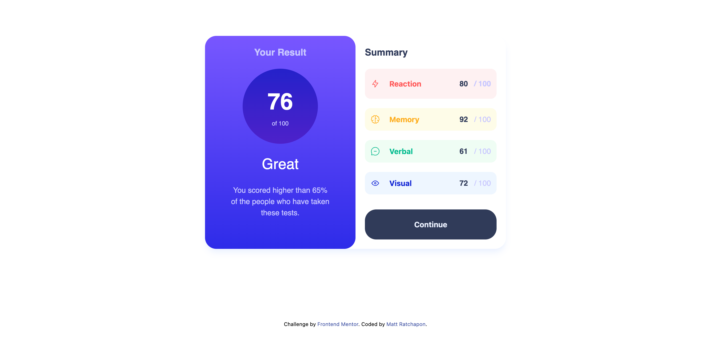
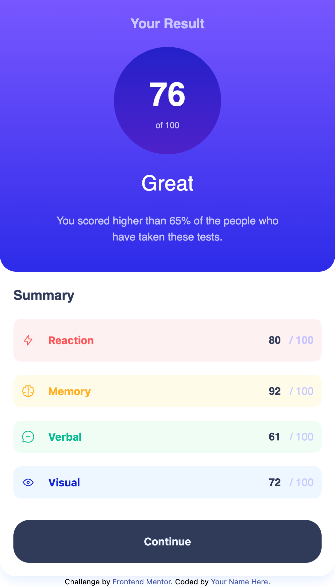

## Table of contents

- [Overview](#overview)
  - [The challenge](#the-challenge)
  - [Screenshot](#screenshot)
  - [Links](#links)
- [My process](#my-process)
  - [Built with](#built-with)
  - [What I learned](#what-i-learned)
  - [Continued development](#continued-development)
  - [Useful resources](#useful-resources)
- [Author](#author)
- [Acknowledgments](#acknowledgments)

## Overview

### The challenge

Your users should be able to:

- View the optimal layout for the interface depending on their device's screen size
- See hover and focus states for all interactive elements on the page

### Screenshot




### Links

- Solution URL: [Github](https://github.com/bbenbboy/10.expenses-chart-component-main.git)
- Live Site URL: [Live Site Url](https://10-expenses-chart-component-main.vercel.app/)

## My process

### Built with

- Semantic HTML5 markup
- CSS custom properties
- Flexbox
- CSS Grid
- Mobile-first workflow
- Tailwindcss

### What I learned

```Javascript
const getData = async function () {
  const response = await fetch("/data.json");
  const data = await response.json();

  //   console.log(data);
  pointData.forEach((point, index) => {
    point.innerHTML = data[index].score;
  });
};
```

### Continued development

This project will be my focus because maybe will work on this project soon after we get hired.

### Useful resources

None

## Author

- Website - [My Resume](https://ratchapon-portfolio.notion.site/Hi-welcome-to-my-portfolio-f45d1ec329d54dac9cd9bf8c217a3f01)
- Frontend Mentor - [@bbenbboy](https://www.frontendmentor.io/profile/bbenbboy)

## Acknowledgments

None
